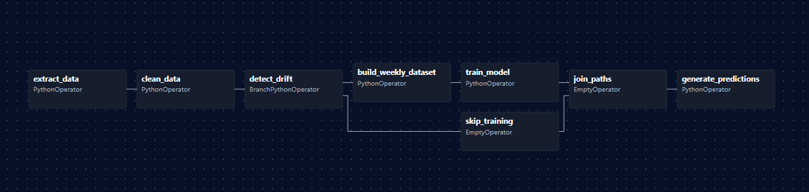

# Pipeline ML con Airflow, MLflow y Optuna

Pipeline automatizado para predecir compras cliente-producto en la siguiente semana, con detección de drift y reentrenamiento condicional.

---

## Estructura de Airflow

```
airflow/
├── dags/main_dag.py       # DAG principal
├── training/
│   ├── data_processing.py        # Limpieza y transformación
│   ├── model_training.py         # Entrenamiento con Optuna + MLflow
│   ├── drift_detection.py        # Detección drift (KS test)
│   ├── prediction.py             # Generación predicciones
│   └── interpretability.py       # Gráficos SHAP
└── requirements.txt              # Dependencias
```

---

## Diagrama del DAG



## Config rápida

Las rutas y nombres de archivos viven en `airflow/config.py`. Puedes ajustar valores editando ese archivo o exportando variables `ML_PIPELINE_*` (por ejemplo `ML_PIPELINE_CLIENTES_FILE`) antes de lanzar Airflow.

---

## Descripción de Tareas

### 1. `extract_data`
Carga `clientes.parquet`, `productos.parquet`, `transacciones.parquet` desde `/opt/airflow/data/` y los persiste como `.pkl`.

### 2. `clean_data`
Elimina duplicados y columnas irrelevantes (X, Y, items).

### 3. `detect_drift`
**Test de Kolmogorov-Smirnov** en variables numéricas (`size`, `num_deliver_per_week`, `num_visit_per_week`):
- **Si p_value < 0.05**: Hay drift → `build_weekly_dataset`
- **Si p_value ≥ 0.05**: No hay drift → `skip_training`
- **Primera ejecución**: No existe referencia → `build_weekly_dataset`

### 4. `skip_training`
Placeholder cuando no hay drift. Usa modelo existente pues no se debe reentrenar.

### 5. `build_weekly_dataset`
Construye dataset semanal con:
- División estratificada temporalmente 70/15/15
- Negative sampling
- Combinaciones cliente-producto-semana

### 6. `train_model`
1. Preprocessing (OneHot + StandardScaler + cyclical weeks)
2. Optimización Optuna
3. Entrenamiento LightGBM
4. Logging MLflow (params, métricas, modelo)
5. SHAP
6. Actualiza referencia para próximo drift

### 7. `join_paths`
Une ramas condicionales (`trigger_rule='none_failed_min_one_success'`).
, es decir, se ejecuta si ninguna fallo y alguna salió bien
### 8. `generate_predictions`
Carga mejor modelo MLflow y predice semana `max + 1`. Output: `predictions_next_week.parquet`.

---

## Lógica para Datos Futuros 

### Diseño
El pipeline compara automáticamente nuevos datos contra referencia guardada:

```python
if existe reference_transacciones.pkl:
    drift = KS_test(nuevos_datos, referencia)
    if drift:
        entrenar_nuevo_modelo()
    else:
        usar_modelo_existente()
else:
    entrenar_nuevo_modelo()
```

### Proceso con Nuevos Datos
1. **Actualizar `data/transacciones.parquet`** con semana t+1
2. **Trigger DAG**
3. **Detección automática**:
   - Drift detectado → Reentrenamiento completo
   - Sin drift → Usa modelo actual
4. **Predicciones** generadas para semana t+2

### Actualización de Referencia
Después de cada entrenamiento, `reference_transacciones.pkl` se actualiza con los datos actuales, asegurando comparaciones incrementales.

### Simulación de nuevos datos

Ejecutar `python airflow/simulate_old_data.py --weeks {cantidad de semanas}` para generar data con todas las semanas menos las últimas {cantidad de semanas} y después ejecutarlo de nuevo añádiendo
esas últimas semanas. Con esto podemos correr el DAG con `transacciones_old_simulation.parquet` y después con `transacciones.parquet` para simular nuevos datos.

---

## Ejecución

### Opción A (recomendada): Docker en Windows

Requiere Docker Desktop.

1) Ir a esta carpeta y construir/levantar el stack:

```powershell
# Desde PowerShell
cd "c:\Users\potat\OneDrive\Escritorio\Lab_MDS\Proyecto 2\airflow"
docker compose build
docker compose up airflow-init
docker compose up -d
```

2) Accesos:

- Airflow UI: http://localhost:8080 (usuario: admin, clave: admin)
- MLflow UI: http://localhost:5000

3) Ubicaciones dentro del contenedor (configuradas por variables de entorno):

- Datos: `/opt/airflow/data`
- Modelos: `/opt/airflow/storage/models`
- Predicciones: `/opt/airflow/storage/predictions`
- MLflow Tracking URI: `http://mlflow:5000`

Coloca tus `clientes.parquet`, `productos.parquet`, `transacciones.parquet` en `Proyecto 2/airflow/data` en tu host; estarán disponibles dentro del contenedor en `/opt/airflow/data`.

4) Ejecutar el DAG desde la UI de Airflow (ml_pipeline) y verificar artefactos y métricas en MLflow.

Para apagar:

```powershell
docker compose down
```

---

### Opción B: Setup en WSL (Windows)

```bash
pip3 install -r requirements.txt

cd airflow

airflow standalone
```

### Acceso
- **Airflow UI**: http://localhost:8080
- Credenciales mostradas en terminal al iniciar `airflow standalone`

### Ejecutar DAG
1. Acceder a http://localhost:8080
2. Buscar DAG `ml_pipeline`
3. Activar toggle
4. Click "Trigger DAG"

---

## Supuestos de Diseño

1. **Datos consistentes**: Mismas columnas en todos los parquets nuevos que puedan aparecer
2. **Drift solo numéricas**: Variables categóricas estables, es decir, no van a aparecer nuevas categorías.
3. **Threshold 0.05**: 95% confianza estadística
4. **Dataset completo en cada entrenamiento**: Se asume que los nuevos datos estarán agregados a los antiguos al momento de entrenar (datasets incrementales)
---
